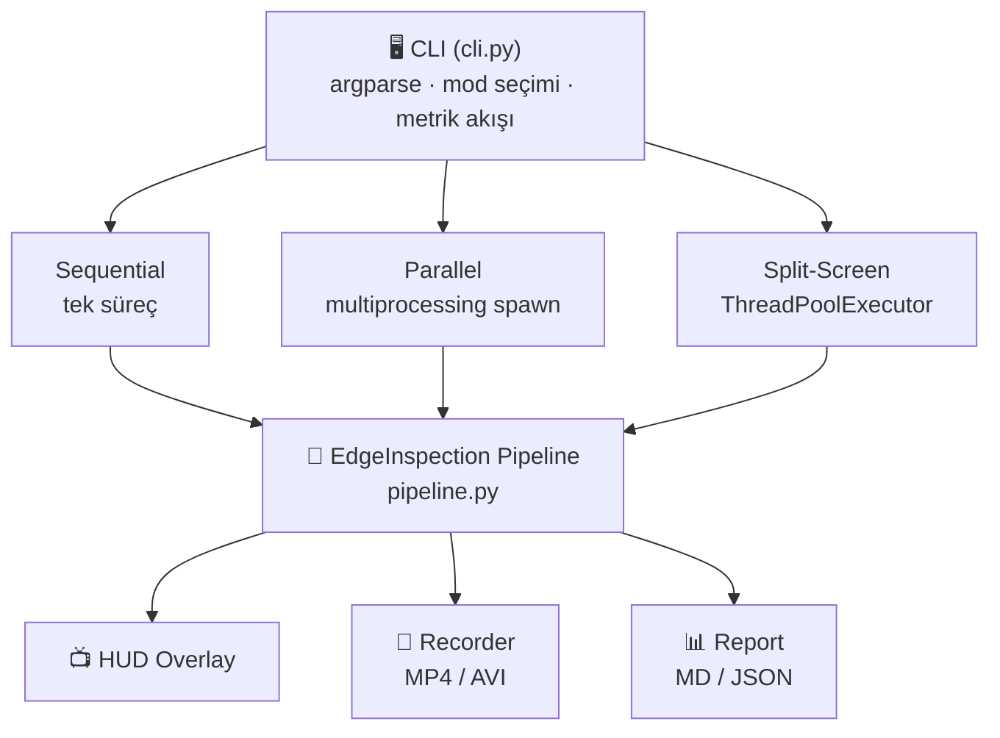
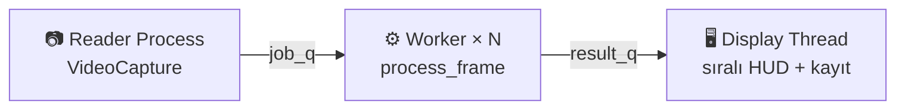

# 🎯 RT Edge Live — Canlı Kenar Analitiği

> Gerçek zamanlı kenar algılama ve paralel programlama performans karşılaştırma aracı

[](https://python.org)
[](https://opencv.org)
[](https://numpy.org)
[](https://www.microsoft.com/windows)
[](#)

---

## 📋 İçindekiler

- [Proje Hakkında](#-proje-hakkında)
- [Özellikler](#-özellikler)
- [Mimari](#-mimari)
- [Kurulum](#-kurulum)
- [Kullanım](#-kullanım)
- [Çalışma Modları](#-çalışma-modları)
- [İşleme Profilleri](#-i̇şleme-profilleri)
- [Çıktı ve Raporlama](#-çıktı-ve-raporlama)
- [Proje Yapısı](#-proje-yapısı)

---

## 🎯 Proje Hakkında

**RT Edge Live**, kamera veya video akışı üzerinde OpenCV tabanlı kenar/görüntü analitiği yapıp aynı iş yükünü **sıralı (sequential)**, **çok süreçli paralel (multiprocessing)** ve **bölünmüş ekran (split-screen)** modlarında karşılaştırmaya olanak tanır.

Temel amaç, paralel programlama tekniklerinin gerçek zamanlı görüntü işleme üzerindeki performans etkisini **ölçülebilir metriklerle** ortaya koymaktır.

> 💡 Sıralı ve paralel iş hatlarının throughput, kare/saniye ve duvar saati gibi ölçülerle somut karşılaştırmasını yapmak.

---

## ✨ Özellikler

- 🔄 **3 Çalışma Modu** — Sequential, Parallel (multiprocessing), Split-Screen
- 🎚️ **4 İşleme Profili** — Fast, Standard, Quality, Stress
- 📊 **Metrik Sistemi** — JSON ve Markdown formatında detaylı performans raporları
- 🎥 **Video Kaydı** — İşlenmiş çıktıyı MP4/AVI olarak kaydetme
- 📺 **HUD Overlay** — Gerçek zamanlı FPS, profil ve kare bilgisi gösterimi
- ⚡ **Spawn Context** — Windows uyumlu `multiprocessing.spawn` mimarisi
- 🧵 **Thread Pool** — Split-screen modunda `ThreadPoolExecutor` entegrasyonu

---

## 🏗 Mimari



**Paralel mod veri akışı:**



---

## 🔧 Kurulum

**Gereksinimler:** Python 3.10+ · Windows 10/11

```powershell
# Repoyu klonlayın
git clone https://github.com/0busrayavuz/parallel-programming.git
cd parallel-programming

# (Opsiyonel) Sanal ortam
python -m venv .venv
.venv\Scripts\Activate.ps1

# Bağımlılıkları yükleyin
python -m pip install -r requirements.txt
```

---

## 🚀 Kullanım

```powershell
python -m rt_edge_live [BAYRAKLAR]
```

### Hızlı Başlangıç

```powershell
# Kamera ile paralel mod (varsayılan)
python -m rt_edge_live --source 0

# Video dosyası ile sıralı mod
python -m rt_edge_live --source demo.mp4 --mode sequential --profile standard

# Tüm bayrakları görmek için
python -m rt_edge_live --help
```

### Performans Karşılaştırma

```powershell
# 1️⃣ Sıralı koşu
python -m rt_edge_live --source demo.mp4 --mode sequential \
    --max-frames 500 --no-window --metrics-out seq.json

# 2️⃣ Paralel koşu
python -m rt_edge_live --source demo.mp4 --mode parallel --workers 4 \
    --max-frames 500 --no-window --metrics-out par.json

# 3️⃣ Karşılaştırma raporu
python -m rt_edge_live --compare-json seq.json par.json --report RAPOR.md
```

### Tek Komutla Çift Ölçüm

```powershell
# Sıralı + paralel koşuyu otomatik yapar, tek JSON çıktı
python -m rt_edge_live --source demo.mp4 --metrics-split-out split.json \
    --max-frames 500 --no-window --profile stress --workers 4
```

### Split-Screen + Video Kaydı

```powershell
# Sol: seri | Sağ: ThreadPool — gerçek zamanlı yan yana karşılaştırma
python -m rt_edge_live --source 0 --mode split-screen \
    --workers 4 --profile standard --record split.mp4
```

---

## 🔀 Çalışma Modları

| Mod | Flag | Mekanizma | Kullanım Amacı |
|-----|------|-----------|----------------|
| **Sequential** | `--mode sequential` | Tek süreç, seri işleme | Temel performans ölçümü (baseline) |
| **Parallel** | `--mode parallel` | `multiprocessing.spawn` ile N işçi | Gerçek çok çekirdekli paralellik |
| **Split-Screen** | `--mode split-screen` | Sol: seri · Sağ: `ThreadPoolExecutor` | Görsel yan yana karşılaştırma |

> ⚠️ Split-screen modunda her iki taraf aynı CPU kaynaklarını paylaşır. Tam throughput karşılaştırması için `sequential` ve `parallel` modlarını ayrı koşularla kullanın.

---

## 🎚 İşleme Profilleri

| Profil | Flag | Pipeline | Ağırlık |
|--------|------|----------|---------|
| **Fast** | `--profile fast` | GaussianBlur(5) → Canny | ⚡ Hafif |
| **Standard** | `--profile standard` | CLAHE → Gaussian(7) → Canny → Morfoloji → Overlay | ⚙️ Orta |
| **Quality** | `--profile quality` | CLAHE → BilateralFilter(9) → Canny → Morfoloji → Overlay | 🔬 Ağır |
| **Stress** | `--profile stress` | CLAHE → MedianBlur(15) → 11× Gaussian(21) + Canny → NumPy | 🔥 Çok ağır |

> 💡 Legacy uyumluluk: `light` → fast, `balanced` → standard, `heavy` → quality

---

## 📊 Çıktı ve Raporlama

### JSON Metrikleri

```powershell
--metrics-out results.json       # Dosyaya yaz (UTF-8)
--metrics-split-out split.json   # Çift ölçüm tek JSON
--metrics-json                   # stdout'a tek satır
```

Örnek çıktı:
```json
{
  "product": "Canli Kenar Analitigi",
  "version": "1.2.1",
  "profile": "standard",
  "mode": "parallel",
  "workers": 4,
  "frames": 500,
  "wall_seconds": 12.345,
  "throughput_frames_per_s": 40.50
}
```

### Markdown Raporu

```powershell
--report rapor.md                              # Tek koşu raporu
--compare-json seq.json par.json --report K.md  # Karşılaştırma raporu
```

### Video Kaydı

```powershell
--record cikti.mp4 --record-fps 30
```

> 📝 `mp4v` codec başarısız olursa otomatik olarak `MJPG` (AVI) formatına düşer.

---

## 🔑 CLI Bayrakları

| Bayrak | Varsayılan | Açıklama |
|--------|-----------|----------|
| `--source` | `0` | Kamera indeksi veya video dosya yolu |
| `--mode` | `parallel` | `sequential` · `parallel` · `split-screen` |
| `--workers` | `CPU-1` | Paralel modda işçi süreç sayısı |
| `--profile` | `standard` | `fast` · `standard` · `quality` · `stress` |
| `--max-frames` | `∞` | N kare sonra dur |
| `--no-window` | — | Görüntü penceresi gösterme |
| `--metrics-out` | — | Metrik JSON dosyasına yaz |
| `--metrics-split-out` | — | Sıralı + paralel çift ölçüm |
| `--record` | — | İşlenmiş videoyu MP4 olarak kaydet |
| `--report` | — | Markdown ölçüm raporu üret |
| `--compare-json` | — | İki JSON ölçümünü karşılaştır |
| `--log-level` | `INFO` | `DEBUG` · `INFO` · `WARNING` · `ERROR` |

---

## 📁 Proje Yapısı

```
parallel-programming/
├── 📄 parallel_video.py        # Giriş shim
├── 📄 requirements.txt         # opencv-python, numpy
├── 📄 README.md
│
└── 📦 rt_edge_live/            # Ana paket
    ├── __init__.py              # Paket tanımı
    ├── __main__.py              # python -m desteği
    ├── cli.py                   # CLI argparse & mod yönlendirme
    ├── runners.py               # sequential / parallel / split-screen
    ├── pipeline.py              # EdgeInspectionPipeline (4 profil)
    ├── mp_workers.py            # multiprocessing okuyucu + işçi
    ├── display.py               # Paralel mod kare tüketimi + HUD
    ├── profiles.py              # Profil tanımları
    ├── report.py                # Markdown rapor üretimi
    ├── recorder.py              # VideoRecorder (MP4/AVI)
    ├── metrics.py               # JSON benchmark payload
    ├── hud.py                   # HUD overlay + rolling FPS
    ├── logging_setup.py         # Log yapılandırması
    ├── constants.py             # Ürün sabitleri
    ├── video_source.py          # Kaynak çözümlemesi
    └── version.py               # v1.2.1
```

---

## 📝 Notlar

- Kaynak kodu **UTF-8** olarak tutun
- Metrik dosyası için PowerShell'de `>` yerine `--metrics-out` kullanın (UTF-16 riski)
- Sürüm bilgisi: `rt_edge_live/version.py`

---

<p align="center">
  Developed by <strong>Büşra Yavuz</strong>
</p>
