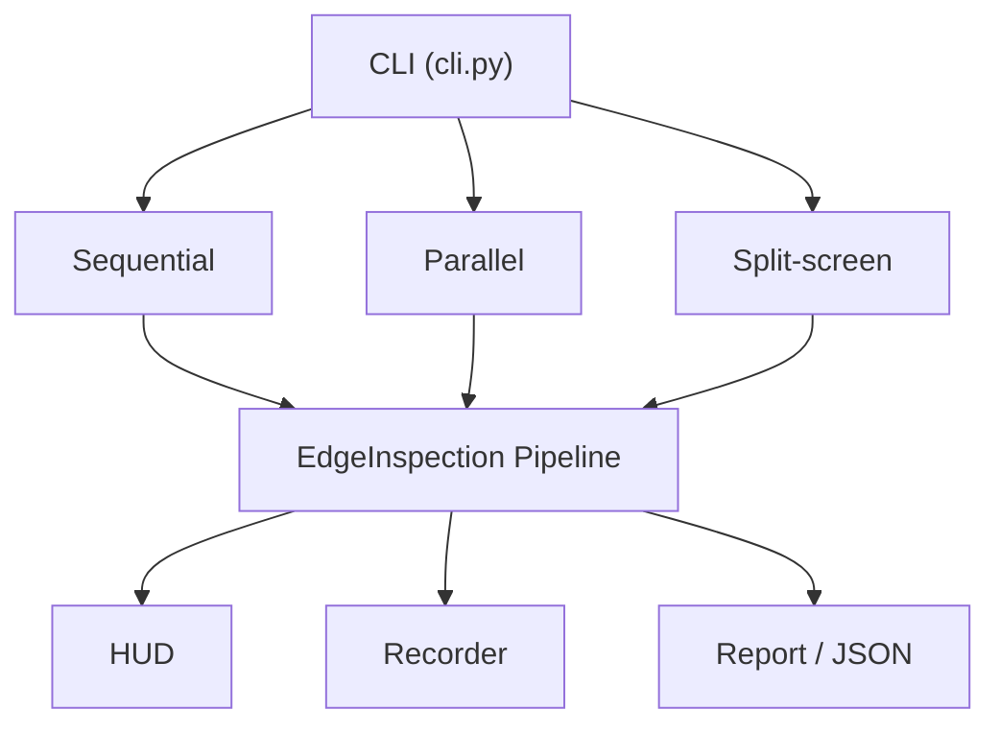
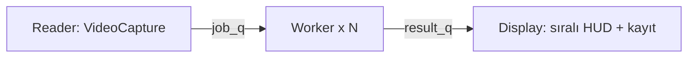

<p align="center">

# RT Edge Live — Canlı Kenar Analitiği

**Gerçek zamanlı kenar algılama ve paralel programlama performans karşılaştırma aracı**

[](https://www.python.org/)
[](https://opencv.org/)
[](https://numpy.org/)
[](https://www.microsoft.com/windows)
[](#)

</p>

---

## İçindekiler

- [Proje hakkında](#proje-hakkında)
- [Özellikler](#özellikler)
- [Mimari](#mimari)
- [Kurulum](#kurulum)
- [Kullanım](#kullanım)
- [Çalışma modları](#çalışma-modları)
- [İşleme profilleri](#işleme-profilleri)
- [Çıktı ve raporlama](#çıktı-ve-raporlama)
- [Proje yapısı](#proje-yapısı)
- [CLI bayrakları](#cli-bayrakları)
- [Notlar](#notlar)

---

## Proje hakkında

**RT Edge Live**, kamera veya video akışı üzerinde OpenCV tabanlı kenar ve görüntü analitiği yapar. Aynı iş yükünü üç modda çalıştırıp karşılaştırmanıza olanak tanır:

| Mod | Açıklama |
|-----|----------|
| **Sequential** | Tek süreç — baseline ölçüm |
| **Parallel** | `multiprocessing` — gerçek çok çekirdek |
| **Split-screen** | Yan yana görsel karşılaştırma |

Temel amaç, paralel programlamanın gerçek zamanlı görüntü işleme üzerindeki etkisini **ölçülebilir metriklerle** (throughput, kare/s, duvar saati) göstermektir.

---

## Özellikler

| Özellik | Açıklama |
|---------|----------|
| 3 çalışma modu | Sequential, parallel, split-screen |
| 4 işleme profili | Fast, standard, quality, stress |
| Metrik sistemi | JSON ve Markdown performans raporları |
| Video kaydı | İşlenmiş çıktı (MP4 / AVI fallback) |
| HUD | Gerçek zamanlı FPS, profil ve kare bilgisi |
| Spawn mimarisi | Windows uyumlu `multiprocessing.spawn` |
| Thread pool | Split-screen’de `ThreadPoolExecutor` |

---

## Mimari



**Paralel mod veri akışı:**



---

## Kurulum

**Gereksinimler:** Python 3.10+ · Windows 10/11

```powershell
git clone https://github.com/0busrayavuz/parallel-programming.git
cd parallel-programming

python -m venv .venv
.venv\Scripts\Activate.ps1

python -m pip install -r requirements.txt
```

---

## Kullanım

```powershell
python -m rt_edge_live [BAYRAKLAR]
```

### Hızlı başlangıç

```powershell
# Kamera, paralel (varsayılan)
python -m rt_edge_live --source 0

# Video, sıralı
python -m rt_edge_live --source demo.mp4 --mode sequential --profile standard

python -m rt_edge_live --help
```

### Benchmark (sıralı vs paralel)

```powershell
python -m rt_edge_live --source demo.mp4 --mode sequential --max-frames 500 --no-window --metrics-out seq.json

python -m rt_edge_live --source demo.mp4 --mode parallel --workers 4 --max-frames 500 --no-window --metrics-out par.json

python -m rt_edge_live --compare-json seq.json par.json --report RAPOR.md
```

### Tek JSON’da çift ölçüm

```powershell
python -m rt_edge_live --source demo.mp4 --metrics-split-out split.json --max-frames 500 --no-window --profile stress --workers 4 --log-level WARNING
```

### Split-screen + kayıt

```powershell
python -m rt_edge_live --source 0 --mode split-screen --workers 4 --profile standard --record split.mp4
```

---

## Çalışma modları

| Mod | Bayrak | Mekanizma | Ne için? |
|-----|--------|-----------|----------|
| Sequential | `--mode sequential` | Tek süreç | Baseline |
| Parallel | `--mode parallel` | N işçi süreç (`spawn`) | Gerçek throughput |
| Split-screen | `--mode split-screen` | Sol seri · sağ thread pool | Görsel demo |

> Split-screen’de iki yol aynı CPU’yu paylaşır. Kesin kıyas için `sequential` ve `parallel` modlarını ayrı koşup `--metrics-out` kullanın.

---

## İşleme profilleri

| Profil | Pipeline özeti | Hedef |
|--------|----------------|-------|
| **fast** | Gaussian → Canny | Düşük gecikme |
| **standard** | CLAHE → Gaussian → Canny → morfoloji → overlay | Dengeli |
| **quality** | CLAHE → bilateral → Canny → morfoloji → overlay | Yüksek kalite |
| **stress** | CLAHE → median → tekrarlı Gaussian + Canny → NumPy | Ağır CPU / demo |

Legacy alias: `light` → fast · `balanced` → standard · `heavy` → quality

---

## Çıktı ve raporlama

| Bayrak | Açıklama |
|--------|----------|
| `--metrics-out` | Metrikleri UTF-8 JSON dosyasına yazar |
| `--metrics-split-out` | Sıralı + paralel ölçümü tek JSON’da |
| `--metrics-json` | Tek satır JSON (stdout) |
| `--report` | Tek koşu Markdown raporu |
| `--compare-json` | İki JSON’u karşılaştırır |
| `--record` | İşlenmiş videoyu kaydeder |

Örnek metrik:

```json
{
  "product": "Canli Kenar Analitigi",
  "version": "1.2.1",
  "mode": "parallel",
  "workers": 4,
  "frames": 500,
  "throughput_frames_per_s": 40.5
}
```

`mp4v` başarısız olursa kayıt otomatik **MJPG (AVI)** formatına düşer.

---

## Proje yapısı

```
paralel/
├── parallel_video.py      # Giriş shim
├── requirements.txt
├── README.md
└── rt_edge_live/
    ├── cli.py             # CLI ve mod yönlendirme
    ├── runners.py         # sequential / parallel / split-screen
    ├── pipeline.py        # Kenar işleme hattı (4 profil)
    ├── mp_workers.py      # Okuyucu + işçi süreçleri
    ├── display.py         # Sıralı kare tüketimi
    ├── profiles.py        # Profil tanımları
    ├── report.py          # Markdown rapor
    ├── recorder.py        # Video kaydı
    ├── metrics.py         # JSON payload
    └── ...
```

---

## CLI bayrakları

| Bayrak | Varsayılan | Açıklama |
|--------|------------|----------|
| `--source` | `0` | Kamera indeksi veya video yolu |
| `--mode` | `parallel` | `sequential` · `parallel` · `split-screen` |
| `--workers` | CPU−1 | Paralel işçi sayısı |
| `--profile` | `standard` | `fast` · `standard` · `quality` · `stress` |
| `--max-frames` | sınırsız | N kare sonra dur |
| `--no-window` | kapalı | Pencere gösterme (benchmark) |
| `--log-level` | `INFO` | Log seviyesi |

Tam liste: `python -m rt_edge_live --help`

---

## Notlar

- Kaynak kod **UTF-8** tutulmalıdır.
- PowerShell’de metrik için `>` yerine `--metrics-out` kullanın (UTF-16 riski).
- Sürüm: `rt_edge_live/version.py` içindeki `__version__`

---

<p align="center">

**Büşra Yavuz**, **Şerife Enginer** ve **Melike Kutlu** tarafından geliştirilmiştir.

</p>
